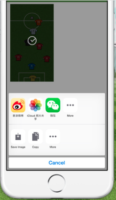
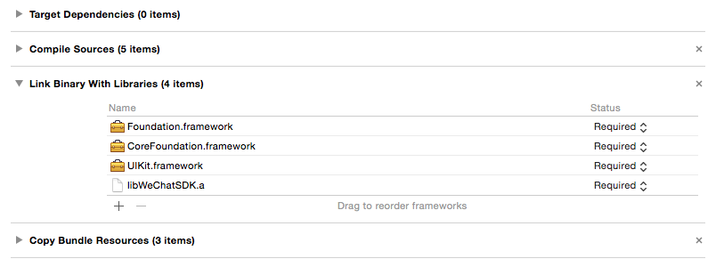

## WeChat Share Activities With Objective-C For iOS8

iOS8的ShareExtension让社交分享功能更容易实现，我个人的应用“踢个球”（[https://itunes.apple.com/us/app/ti-ge-qiu/id980151813?l=zh&ls=1&mt=8](https://itunes.apple.com/us/app/ti-ge-qiu/id980151813?l=zh&ls=1&mt=8)），第一时间使用ShareExtension来快速实现微信分享功能（UIActivityViewController）。


好景不长，iOS8.3的推出让微信的ShareExtension失效了。到目前微信已经撤下了其ShareExtension。
思考下shareExtension被撤下，可能的原因之一是开发者不用向企鹅申请开发资格就可以使用其分享功能，对于企鹅没有什么有利的地方。
有些使用场景用UIActivityViewController的方式来做分享确实十分方便，看一下Twitter、FB、Weibo。那么就自定义一个ActivityItem实现微信分享功能。

### 配置(环境Xcode6.2，iOS8.3)
### 申请一个微信开放平台账号
https://open.weixin.qq.com/

### 添加分享按钮的图片
将ShareButtonImgs文件夹中的6个图片文件加入到project中

### 添加微信SDK和其必需的资源
将WeChatSDK文件夹和WeCharShareActivityComponent文件夹拖入到project中，再链接几个framework


### 一些代码的配置
在AppDelegate.m中 #import "WXApi.h" 添加代码如下

```
	- (BOOL)application:(UIApplication *)application didFinishLaunchingWithOptions:(NSDictionary *)launchOptions {
	  [WXApi registerApp:@“你的微信AppID”];
	  return YES;
	}
```

在需要加入微信分享的地方加入

```
	  UIImage *shareMomentImage = [UIImage imageNamed:@"wechat_moments"];
	  UIImage *shareSessionImage = [UIImage imageNamed:@"wechat_session"];
	  NSArray *activityItems = @[shareMomentImage, shareSessionImage];
	  WeChatMomentsActivity *momentsActivity = [[WeChatMomentsActivity alloc] init];
	  WeChatSessionActivity *sessionActivity = [[WeChatSessionActivity alloc] init];
	  NSArray *activities = @[momentsActivity, sessionActivity];
	  UIActivityViewController *activityView = [[UIActivityViewController alloc] initWithActivityItems:activityItems
	 applicationActivities:activities];
	 
	  [self presentViewController:activityView animated:YES completion:nil];
```


 
